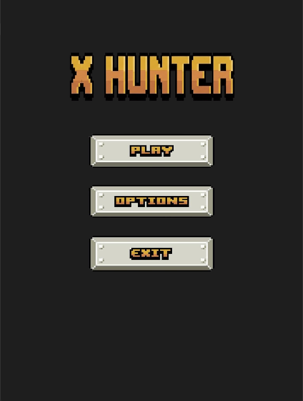
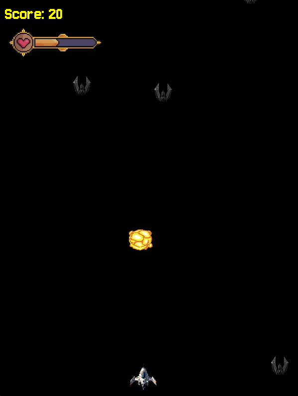
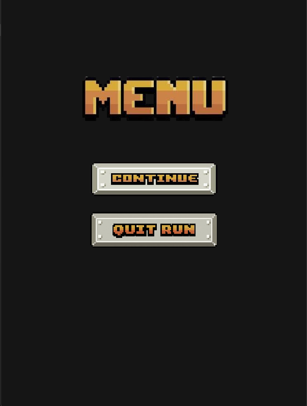

# 🚀 X Hunter

**X Hunter** is a 2D arcade-style space shooter built with **Python** and **Pygame**. Take control of a futuristic spaceship, destroy incoming enemy ships, survive as long as possible, and achieve the highest score.

This project was created to strengthen my skills in Python game development, object-oriented programming, game architecture, and asset management.


## 🛠 Built With

- Python.
- Pygame.

---

## 📷 Screenshots

```
# Main Menu



# Gameplay



# Game Over



```

---

## 🎮 Controls

| Key --> Action |
|---------------|
| ← → --> Move Ship |
| Space --> Shoot |
| ESC --> Pause / Resume |
| Mouse --> Navigate Menus |

---

## 📥 Download

The latest playable version is available in the **Releases** section.

1. Download the latest **X_Hunter.zip**
2. Extract the ZIP file
3. Run **X_Hunter.exe**

Note : There are two Source code files that you don't need to download and no Python installation is required.

---

## 👨‍💻 Author

**Kuldip**

If you enjoyed this project, don't forget to ⭐ the repository!
